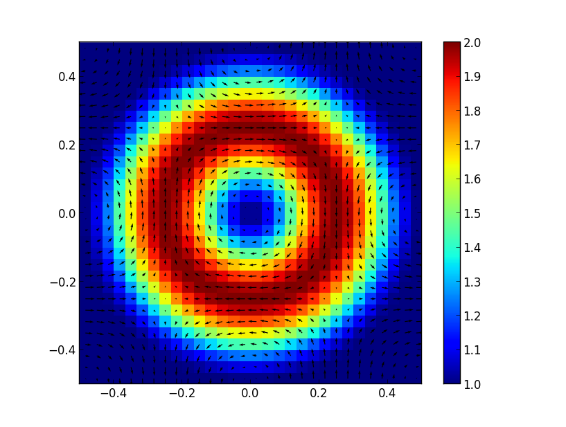

# Vortex with centered density perturbation

Doubly-periodic domain.

\begin{eqnarray}
x \in [-0.5, 0.5], y \in [-0.5, 0.5],\\
r = \sqrt{x^2 + y^2},\\
u = cos(2\pi x)sin(2\pi y),\\
v = sin(-2\pi x)cos(2\pi y),\\
\rho = 
\begin{cases}
 1.0 + cos(2\pi(r-0.25))^2 & \text{ if } r < 0.5 \\ 
   1.0 & \text{ otherwise }
  \end{cases}
\end{eqnarray}

